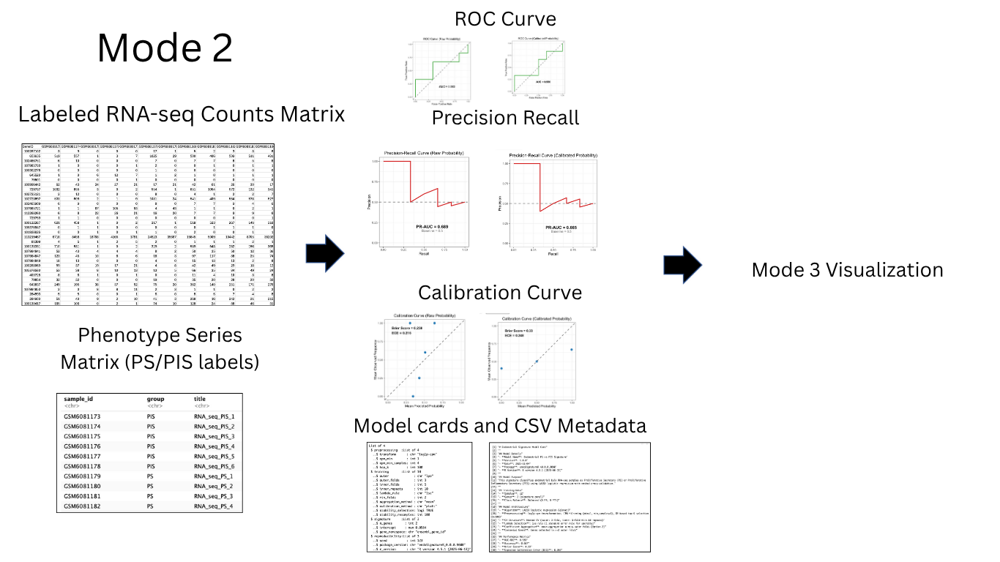
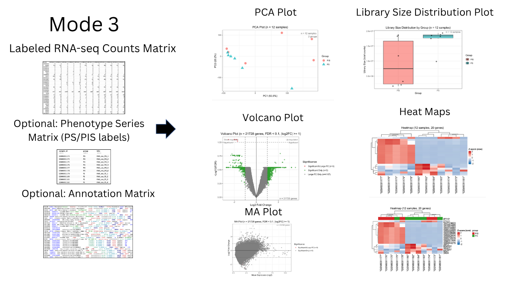

<!-- README.md is generated from README.Rmd. Please edit that file -->

```{r, include = FALSE}
knitr::opts_chunk$set(
  collapse = TRUE,
  comment = "#>",
  fig.path = "man/figures/README-",
  out.width = "100%"
)
```

# EndoSignatureR

Leakage-Safe Gene Signature Discovery for Small RNA-seq Cohorts

<!-- badges: start -->

[](https://github.com/amcwong/endoSignatureR/issues)  
[](./LICENSE)  
  


<!-- badges: end -->

## Description

`EndoSignatureR` is an R package designed to make it easy for researchers to analyze and compare small endometrial bulk RNA-seq datasets using a standardized, reproducible workflow. It provides ready-to-use preprocessing, validation, and classification functions built around a pre-trained endometrial gene signature derived from public data such as GSE201926. The package ensures that new datasets are processed using the same transformations, gene identifiers, and scaling as the reference, allowing users to generate consistent signature scores, perform differential analyses, and visualize results through clear, publication-ready plots.

By offering a unified analysis pipeline, `EndoSignatureR` helps overcome the fragmentation of endometrial transcriptomic data across studies. Researchers can easily benchmark their own experiments against public references, explore molecular similarities and differences across hormonal states or disease conditions, and reproduce analysis steps without extensive coding. This tool aims to accelerate exploratory and comparative endometrial research by providing a transparent, extensible foundation for small-scale RNA-seq investigations.

The package ships with a pre-trained PS vs PIS gene signature derived from GSE201926 and provides three complementary workflows:

- **Rapid Classification (Mode 1):** Apply the shipped signature to unlabeled RNA-seq samples to obtain PS vs PIS predictions with confidence.
- **Signature Validation (Mode 2):** Train/validate a new signature on labeled cohorts using best practices (in-fold preprocessing, DE screening, nested cross-validation, LASSO with calibration, and optional stability selection), then compare to the pre-trained signature.
- **Visualization & Analysis (Mode 3):** Perform standalone QC, exploratory analysis, and differential expression visualization on endometrial data without requiring training or classification.

This package centralizes typical multi-step analyses (QC, DE screening, model training, calibration, performance visualization, and export of artifacts) into a cohesive, reproducible workflow tailored for endometrial tissue.

The package will be developed and tested on a recent R version and platform; see the SessionInfo section below for exact versions captured during validation.

## Installation

To install the latest version of the package:

**Note**: This package depends on Bioconductor packages (`ComplexHeatmap` and `limma`). You must install Bioconductor dependencies first:

```r
# Install BiocManager if not already installed
if (!requireNamespace("BiocManager", quietly = TRUE)) {
    install.packages("BiocManager")
}

# Install Bioconductor dependencies
BiocManager::install(c("ComplexHeatmap", "limma"))

# Install devtools if not already installed
install.packages("devtools")

# Install endoSignatureR from GitHub
library("devtools")
devtools::install_github("amcwong/endoSignatureR", build_vignettes = TRUE)
library("endoSignatureR")
```

**Alternative**: You can also use `BiocManager::install()` which handles both CRAN and Bioconductor dependencies automatically:

```r
if (!requireNamespace("BiocManager", quietly = TRUE)) {
    install.packages("BiocManager")
}
BiocManager::install("amcwong/endoSignatureR", build_vignettes = TRUE)
```

To run the shinyApp:

```r
runEndoSignatureR()
```

## Overview

```r
ls("package:endoSignatureR")
data(package = "endoSignatureR") # optional
browseVignettes("endoSignatureR")
```

`EndoSignatureR` provides core functions aligned with the following plan:

1.  `esr_validateEndometrial(X, pheno, annot = NULL, label_col = "group")`: endometrial-specific schema/ID checks; returns cleaned objects and issues table.
2.  `esr_loadPretrainedSignature()`: load the shipped PS vs PIS signature from GSE201926.
3.  `esr_classifyEndometrial(X_new, signature = NULL, threshold = 0.5, confidence = TRUE)`: apply pre-trained signature to new samples; predictions + confidence.
4.  `esr_trainEndometrialSignature(...)`: train a new signature using in-fold transforms, DE screening, nested CV, LASSO, calibration, and optional stability selection.
5.  `esr_compareSignatures(pretrained_result, new_result)`: compare pre-trained vs new signature performance.
6.  Export helpers: `esr_exportSignature(...)`.

Plotting helpers (examples):

- QC/EDA: `plotEndometrialPCA`, `plotEndometrialLibsize`, `plotEndometrialZeros`
- DE/Signature: `plotEndometrialMA`, `plotEndometrialVolcano`, `plotEndometrialHeatmap`, `plotEndometrialCoefLollipop`, `plotEndometrialStabilityBars`
- Performance: `plotEndometrialROC`, `plotEndometrialPR`, `plotEndometrialCalibration`, `plotEndometrialComparison`

<!-- An overview of the package is illustrated below.

 -->

### Three-Mode Workflow

The package provides three workflows:

**Mode 1: Rapid Classification** - Apply the pre-trained signature to unlabeled samples for PS vs PIS predictions.


**Mode 2: Signature Validation** - Train and validate a new signature on labeled cohorts using best practices.



**Mode 3: Visualization & Analysis** - Perform standalone QC, exploratory analysis, and differential expression visualization.



## Contributions

The author of the package is Andrew Wong. The author designed and implemented the endometrial-specific workflows and functions listed above, integrating established methods (DE screening, LASSO via glmnet, nested cross-validation) into a cohesive package for PS vs PIS classification and validation.

Contributions from other packages/sources for each function: The core analysis functions (`esr_trainEndometrialSignature`, `esr_validateEndometrial`, `esr_analyzeDifferentialExpression`) build upon `glmnet` (Friedman et al., 2010) for LASSO regularization, `limma` (Ritchie et al., 2015) for differential expression analysis, and `rsample` (Frick et al., 2025) for cross-validation resampling. The plotting functions (`plotEndometrial*`) use `ggplot2` (Wickham, 2016) for base graphics, `ComplexHeatmap` (Gu et al., 2016) for heatmap visualization, and `circlize` (Gu et al., 2014) for circular visualizations. The data loading functions (`endo_load_*`, `esr_load*`) use `readr` (Wickham et al., 2024) for file I/O and `jsonlite` (Ooms, 2014) for JSON parsing. The calibration functions (`calibrate_*`, `compute_*`) implement established methods (Platt scaling, isotonic regression) using base R `stats` functions. The export functions (`esr_export*`, `export_*`) use `jsonlite` for JSON export and base R for CSV export.

Contributions from generative AI tool(s) for each function: GitHub Copilot was used extensively throughout the test suite (`tests/testthat/test-*.R`) for generating test cases, assertions, and test fixtures. It was also used for code completions in R source files, particularly for repetitive patterns in plotting functions and data validation logic. ChatGPT was used for commenting and proofreading documentation (roxygen comments), README sections, and vignettes. It was also used for brainstorming function signatures and workflow design in early development stages. All outputs from AI tools were reviewed, validated, and modified by the author before inclusion. No AI-generated code was used verbatim without review.

## References

- Allaire, J. J., Xie, Y., Dervieux, C., McPherson, J., Luraschi, J., Ushey, K., Atkins, A., Wickham, H., Cheng, J., Chang, W., & Iannone, R. (2024). rmarkdown: Dynamic documents for R. R package. <https://CRAN.R-project.org/package=rmarkdown>.

- Edgar, R., Domrachev, M., & Lash, A. E. (2002). Gene Expression Omnibus: NCBI gene expression and hybridization array data repository. Nucleic Acids Research, 30(1), 207–210. <https://doi.org/10.1093/nar/30.1.207>.

- Friedman, J., Hastie, T., & Tibshirani, R. (2010). Regularization paths for generalized linear models via coordinate descent. Journal of Statistical Software, 33(1), 1–22. doi:10.18637/jss.v033.i01 <https://doi.org/10.18637/jss.v033.i01>.

- GitHub & OpenAI. (2025). GitHub Copilot: AI-powered code completion assistant. GitHub, Inc., San Francisco, USA. <https://github.com/features/copilot>.

- Gu, Z., Eils, R., & Schlesner, M. (2016). Complex heatmaps reveal patterns and correlations in multidimensional genomic data. Bioinformatics. doi:10.1093/bioinformatics/btw313

- Gu, Z., Gu, T., Eils, R., Schlesner, M., & Brors, B. (2014). circlize implements and enhances circular visualization in R. Bioinformatics, 30(19), 2811–2812.

- Frick, H., Chow, F., Kuhn, M., Mahoney, M., Silge, J., & Wickham, H. (2025). rsample: General resampling infrastructure. R package. <https://CRAN.R-project.org/package=rsample>.

- Love, M. I., Huber, W., & Anders, S. (2014). Moderated estimation of fold change and dispersion for RNA-seq data with DESeq2. Genome Biology, 15(12), 550. <https://doi.org/10.1186/s13059-014-0550-8>.

- Ooms, J. (2014). The jsonlite package: A practical and consistent mapping between JSON data and R objects. arXiv:1403.2805 [stat.CO]. <https://arxiv.org/abs/1403.2805>.

- OpenAI. (2025). ChatGPT (GPT-5) [Large language model]. OpenAI, San Francisco, USA. <https://chat.openai.com/>.

- R Core Team (2025). R: A language and environment for statistical computing. R Foundation for Statistical Computing, Vienna, Austria. <https://www.R-project.org/>.

- Ritchie, M. E., Phipson, B., Wu, D., Hu, Y., Law, C. W., Shi, W., & Smyth, G. K. (2015). limma powers differential expression analyses for RNA-sequencing and microarray studies. Nucleic Acids Research, 43(7), e47.

- Robin, X., et al. (2011). pROC: an open-source package for R and S+ to analyze and compare ROC curves. BMC Bioinformatics, 12, 77. <https://doi.org/10.1186/1471-2105-12-77>.

- Silva, A. (2019–2025). TestingPackage: R Package Illustrating Components of an R package for BCB410H. GitHub. <https://github.com/anjalisilva/TestingPackage>.

- Wickham, H. (2016). ggplot2: Elegant Graphics for Data Analysis. Springer-Verlag New York.

- Wickham, H. (2011). testthat: Get started with testing. The R Journal, 3, 5-10. <https://CRAN.R-project.org/package=testthat>.

- Wickham, H., Pedersen, T., & Seidel, D. (2025). scales: Scale functions for visualization. R package. <https://CRAN.R-project.org/package=scales>.

- Wickham, H., Hester, J., & Chang, W. (2024). devtools: Tools to Make Developing R Packages Easier. R package. <https://CRAN.R-project.org/package=devtools>.

- Wickham, H., Hester, J., & Bryan, J. (2024). readr: Read rectangular text data. R package. <https://CRAN.R-project.org/package=readr>.

- Xie, Y. (2025). knitr: A general-purpose package for dynamic report generation in R. R package. <https://CRAN.R-project.org/package=knitr>.

## Other Topics

### Statistical Assumptions

The signature creation process in `EndoSignatureR` relies on several statistical assumptions:

1. **Data type**: Bulk RNA-seq gene counts from endometrial tissue (not single-cell, not microarray, not other tissues). The pre-trained signature is specific to endometrial tissue and is not portable across tissues or divergent processing pipelines.

2. **Design**: Binary labels (PS vs PIS) with independent biological replicates. The package supports only binary classification; multiclass or continuous outcomes are out of scope for v1.

3. **Modeling**: Linear log-odds relationship (logistic regression) with L1 penalty (LASSO) that selects a sparse set of genes. The L1 penalty drives most coefficients to zero, yielding an interpretable gene signature.

4. **Resampling**: Nested cross-validation is used as a proxy for generalization in small-n datasets. Leave-pair-out (LPO) cross-validation is used when n is tiny and class-balanced to maximize training data while maintaining valid test sets.

5. **Feature selection**: DE screening improves stability in p≫n scenarios (where the number of features greatly exceeds the number of samples). Top-K gene selection based on differential expression statistics helps focus the model on biologically relevant features.

6. **Anti-leakage**: All preprocessing operations (transformation, filtering, gene selection) occur inside cross-validation folds to avoid data leakage. Preprocessing parameters are computed from training data only, then applied to test data.

These assumptions are important for proper interpretation of signature results and should be considered when applying the package to new datasets.

### Acknowledgements

This package was developed as part of an assessment for 2025 BCB410H: Applied Bioinformatics course at the University of Toronto, Toronto, CANADA. `EndoSignatureR` welcomes issues, enhancement requests, and other contributions. To submit an issue, use the GitHub issues page for your repository.

### SessionInfo

R version 4.5.1 (2025-06-13)
Platform: aarch64-apple-darwin20
Running under: macOS Sequoia 15.6.1

Matrix products: default
BLAS: /System/Library/Frameworks/Accelerate.framework/Versions/A/Frameworks/vecLib.framework/Versions/A/libBLAS.dylib
LAPACK: /Library/Frameworks/R.framework/Versions/4.5-arm64/Resources/lib/libRlapack.dylib; LAPACK version 3.12.1

locale:
[1] en_US.UTF-8/en_US.UTF-8/en_US.UTF-8/C/en_US.UTF-8/en_US.UTF-8

time zone: America/Toronto
tzcode source: internal

attached base packages:
[1] grid stats graphics grDevices utils datasets methods base

other attached packages:
[1] ComplexHeatmap_2.24.1 ggplot2_4.0.0 glmnet_4.1-10 Matrix_1.7-3  
[5] rsample_1.3.1 endoSignatureR_0.0.0.9000 testthat_3.2.3

loaded via a namespace (and not attached):
[1] tidyselect_1.2.1 dplyr_1.1.4 farver_2.1.2 S7_0.2.0 fastmap_1.2.0  
 [6] pROC_1.19.0.1 digest_0.6.37 lifecycle_1.0.4 cluster_2.1.8.1 waldo_0.6.2  
[11] ellipsis_0.3.2 survival_3.8-3 statmod_1.5.0 magrittr_2.0.4 compiler_4.5.1  
[16] rlang_1.1.6 tools_4.5.1 yaml_2.3.10 knitr_1.50 labeling_0.4.3  
[21] bit_4.6.0 pkgbuild_1.4.8 xml2_1.4.0 RColorBrewer_1.1-3 pkgload_1.4.1  
[26] withr_3.0.2 purrr_1.1.0 BiocGenerics_0.54.1 desc_1.4.3 stats4_4.5.1  
[31] roxygen2_7.3.3 future_1.67.0 colorspace_2.1-2 globals_0.18.0 scales_1.4.0  
[36] iterators_1.0.14 cli_3.6.5 rmarkdown_2.29 crayon_1.5.3 generics_0.1.4  
[41] remotes_2.5.0 rstudioapi_0.17.1 tzdb_0.5.0 rjson_0.2.23 commonmark_2.0.0  
[46] sessioninfo_1.2.3 cachem_1.1.0 stringr_1.5.2 splines_4.5.1 parallel_4.5.1  
[51] matrixStats_1.5.0 vctrs_0.6.5 devtools_2.4.6 jsonlite_2.0.0 IRanges_2.42.0  
[56] hms_1.1.4 GetoptLong_1.0.5 S4Vectors_0.46.0 bit64_4.6.0-1 clue_0.3-66  
[61] listenv_0.10.0 foreach_1.5.2 limma_3.64.3 tidyr_1.3.1 parallelly_1.45.1  
[66] glue_1.8.0 codetools_0.2-20 stringi_1.8.7 shape_1.4.6.1 gtable_0.3.6  
[71] tibble_3.3.0 furrr_0.3.1 pillar_1.11.1 htmltools_0.5.8.1 brio_1.1.5  
[76] circlize_0.4.16 R6_2.6.1 doParallel_1.0.17 rprojroot_2.1.1 vroom_1.6.6  
[81] evaluate_1.0.5 lattice_0.22-7 readr_2.1.5 png_0.1-8 memoise_2.0.1  
[86] Rcpp_1.1.0 xfun_0.53 fs_1.6.6 usethis_3.2.1 pkgconfig_2.0.3  
[91] GlobalOptions_0.1.2
